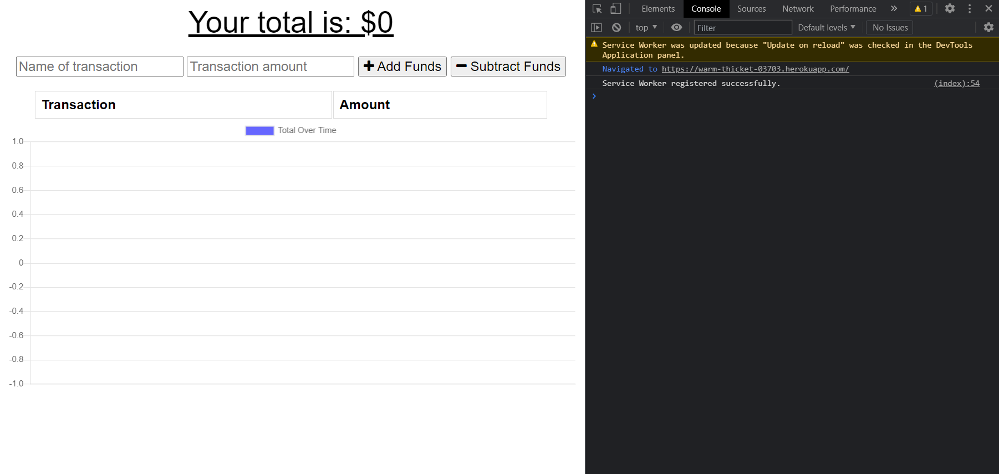

# Budget Tracker <!-- omit in toc -->

- [Description](#description)
- [Demo](#demo)

## Description

The budget tracker is an application that allows users to track their income and expenditures though a simple and intuitive interface. Users will simply enter a transaction then will be presented with a graphical representation of their budget.

Data for the budget tracker app is persisted in a database so consecutice visits to the budget tracker will still show their previously entered transactions. Users may also still make transactions offline to be later stored in the database once the app reconnects to the internet. Lastly, the application is downloadable as a desktop or phone app for easy user access.

Data persistence, offline usability, and ability to download it as an app make the budget tracker a progressive web application.

## Demo

The live deployed application can be found [here](https://warm-thicket-03703.herokuapp.com/).

Upon page load, the user is presented with a graphical interface that represents their budget over time. When a user enters values and clicks either of the buttons, the graph will show their budget decreasing or increasing depending on which button they pressed. Since data is persisted in a database, consecutive visits to the budget tracker will show the transaction history.

When a user is online, transactions will post immediately to the page and then post the data to the database.

If a user goes offline while using the app, transactions will be stored in the IndexedDB API. The transaction will still show up on the budget, but will not be persisted in the database until the app reconnects to the internet.

Once the user reconnects, the transactions made while offline will post to the database.

The app is also available as a progressive web application download from the browser. The application has all the same functionality as in the browser.

